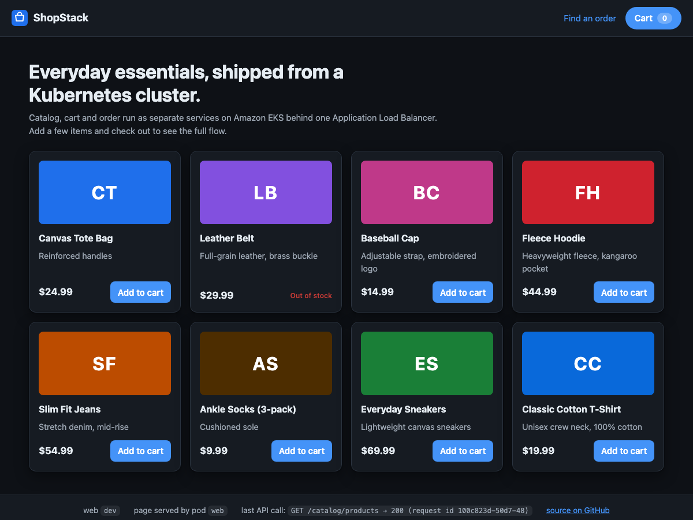
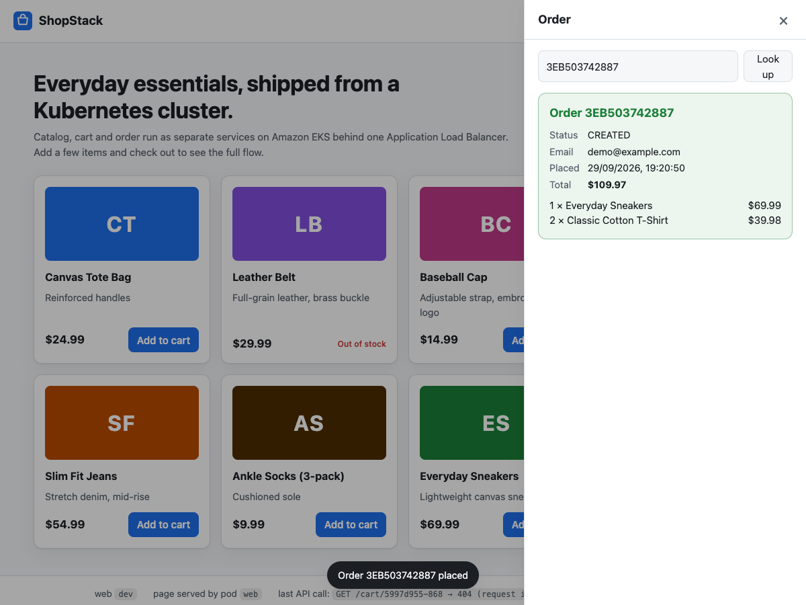

# ShopStack — Containerized Retail Microservices on Amazon EKS

[](https://github.com/venkataraogurram/shopstack/actions/workflows/ci.yml)

Three small retail services (**catalog**, **cart**, **order**) built with FastAPI plus a static **web** storefront on Nginx, containerized, and run on Amazon EKS behind one Application Load Balancer. Everything from the VPC to the IAM roles is Terraform; the app is deployed with Kustomize; images are built and pushed by GitHub Actions.

The point of the project is the platform work, not the shop: least-privilege IAM at pod level, hardened pods, autoscaling, and observability wired so that one request ID can be followed through every service in CloudWatch.

**Live demo:** http://k8s-shopstac-shopstac-74660dbaab-1502118291.us-east-1.elb.amazonaws.com (plain HTTP on the ALB hostname; the cluster is torn down between demo periods, so the link may be offline).



| Storefront | Checkout |
|---|---|
|  |  |

## What is in the box

| Layer | Choice | Why |
|---|---|---|
| Compute | Amazon EKS 1.34, managed node group (AL2023, t3.medium ×2–4), private subnets | Managed control plane; nodes are never internet-facing |
| Networking | VPC with 2 AZs, public subnets only for the ALB, single NAT gateway | Cheap demo shape; documented how to go to one NAT per AZ |
| Ingress | AWS Load Balancer Controller (Helm) → one ALB, path routing, `target-type: ip` | ALB registers pod IPs directly; no NodePort hop |
| Identity | EKS Pod Identity: one IAM role per ServiceAccount (`cart`, `order`, LB controller, CloudWatch agent) | Pods get short-lived credentials for exactly their table; the node role has no application permissions |
| State | DynamoDB on-demand (`shopstack-carts`, `shopstack-orders`), PITR on | Serverless, no VPC plumbing, conditional writes for idempotent orders |
| Config | ConfigMaps for service URLs / table names; product list mounted as a file with a content hash | Catalog changes without an image rebuild, hash triggers a rolling restart |
| Hardening | Namespace enforces Pod Security Standard **restricted**; non-root (UID 10001 for the APIs, 101 for Nginx), read-only root FS, all capabilities dropped, seccomp RuntimeDefault, IMDSv2 hop-limit 1 | A privileged pod is rejected at admission |
| Reliability | Startup/readiness/liveness probes, requests + memory limits, HPA (CPU 60%, 2–6 for APIs, 2–4 for web), PodDisruptionBudget, topology spread, rolling update `maxUnavailable: 0`, VPC CNI prefix delegation | Verified: HPA scaled 2→6 in ~40 s under load; node group replaced with no downtime |
| Observability | CloudWatch Observability add-on (Container Insights + Fluent Bit), JSON logs with `X-Request-ID` propagated across services | One Logs Insights query shows a checkout across all three services |
| Delivery | GitHub Actions: ruff + pytest per API, `terraform validate`, `kubectl kustomize`, `nginx -t` on the web image, then build/push all four images to ECR with OIDC (no stored keys) on `main` | Immutable ECR tags = commit SHA; re-runs skip already-published tags; deploy is `scripts/deploy.sh <sha>` |

## Services

| Service | Endpoints | Talks to | AWS access |
|---|---|---|---|
| `catalog` | `GET /catalog/products`, `GET /catalog/products/{sku}` | — | none |
| `cart` | `GET /cart/{id}`, `POST /cart/{id}/items`, `DELETE /cart/{id}/items/{sku}`, `DELETE /cart/{id}` | catalog (validate SKU, snapshot price) | `dynamodb:GetItem/UpdateItem/DeleteItem` on carts table |
| `order` | `POST /orders`, `GET /orders/{id}` | cart (read + clear), catalog (re-price, stock check) | `dynamodb:PutItem/GetItem` on orders table |
| `web` | `GET /` storefront (vanilla HTML/JS on unprivileged Nginx, UID 101) | the three APIs via the same origin | none |

All services expose `/healthz` (liveness) and `/ready` (readiness; the APIs check their store), listen on 8080, and accept/propagate `X-Request-ID`. The APIs log JSON to stdout; the storefront footer shows the build SHA, the `web` pod that served the page, and the last API call with its request ID, so load balancing and tracing are visible in the browser. Prices are integer cents end to end.

```
$ curl -s $ALB/catalog/products | jq '.[0]'
{ "sku": "BAG-008", "name": "Canvas Tote Bag", "unit_price_cents": 2499, "currency": "USD", "in_stock": true }

$ curl -s -X POST $ALB/cart/demo/items -H 'content-type: application/json' -d '{"sku":"TSH-001","qty":2}' | jq .subtotal_cents
3998

$ curl -s -X POST $ALB/orders -H 'content-type: application/json' -d '{"cart_id":"demo","customer_email":"a@example.com"}' | jq '{order_id,total_cents,status}'
{ "order_id": "777EC7113D45", "total_cents": 3998, "status": "CREATED" }
```

## Repository layout

```
services/<catalog|cart|order>/   FastAPI app, Dockerfile, tests (pytest), requirements
services/web/                     Static storefront + Nginx config (no build step)
terraform/                        VPC, EKS + add-ons, ECR, DynamoDB, Pod Identity roles, GitHub OIDC role
k8s/                              Kustomize base: namespace, SAs, ConfigMaps, Deployments, Services, HPAs, PDBs, Ingress
scripts/                          build-push, install-addons, deploy, smoke-test, load-test, teardown
.github/workflows/ci.yml          test → validate → build & push (OIDC)
docs/                             architecture diagram, evidence from the live run
compose.yaml                      run everything locally (in-memory store, no AWS; an Nginx "edge" mimics the ALB path routing)
```

## Run it

Prerequisites: AWS CLI v2 with credentials, Terraform ≥ 1.6, kubectl, Helm, and Docker or Finch.

```bash
# 0. Local only (no AWS): storefront on http://localhost:9080 (APIs also on :9081/:9082/:9083)
finch compose up --build            # or: docker compose up --build

# 1. Infrastructure (~15 min; creates VPC, EKS, ECR, DynamoDB, IAM)
cd terraform && terraform init && terraform apply && cd ..

# 2. kubeconfig + AWS Load Balancer Controller (metrics-server and CloudWatch are EKS add-ons)
scripts/install-addons.sh

# 3. Build linux/amd64 images and push to ECR (tag = git short SHA)
TAG=$(scripts/build-push.sh | tail -1)

# 4. Deploy and wait for the ALB
scripts/deploy.sh "$TAG"            # prints http://k8s-shopstac-...elb.amazonaws.com

# 5. Check it end to end, then watch the HPA scale under load
scripts/smoke-test.sh http://<alb-hostname>
scripts/load-test.sh  http://<alb-hostname> 240 8

# 6. Everything off (ALB first, then the cluster)
scripts/teardown.sh
```

CI needs one repository variable: `AWS_ROLE_ARN` = the `github_actions_role_arn` Terraform output. The role trusts only the `main` branch of this repository (both the classic and the immutable GitHub OIDC subject formats, see fix 4 below).

## Evidence from the live run

Recorded against the deployed cluster (us-east-1) — see [`docs/evidence/`](docs/evidence/).

- **Storefront**: `GET /` serves the page from the `web` pods (`X-Served-By: web-…` shows which one); the browser flow add → cart → checkout → order lookup was driven with Puppeteer and screenshotted above.
- **End-to-end through the ALB**: catalog → add two items → out-of-stock SKU rejected (409) → checkout (201) → order readable (200) → cart cleared (404). Order `777EC7113D45` present in `shopstack-orders`.
- **Least privilege proven from inside a pod**: `sts get-caller-identity` from a cart pod = `assumed-role/shopstack-cart/…`; `PutItem` on `shopstack-orders` → `AccessDeniedException`; `DescribeTable` on `shopstack-carts` → `ACTIVE`.
- **Pod Security**: `kubectl run … --privileged` in the namespace → `Forbidden: violates PodSecurity "restricted:latest"`.
- **Tracing**: one Logs Insights query on the request ID returned 10 lines across `catalog`, `cart`, `order` — the whole checkout, with per-hop latency.
- **Autoscaling**: 8 in-cluster load generators; catalog CPU 2% → 248% → 441%; replicas 2 → 6 within 40 s, zero Pending; scaled back after the 120 s stabilization window ([log](docs/evidence/hpa-load-test.log)).
- **Zero-downtime node replacement**: the launch-template change for prefix delegation rolled both nodes while the smoke test kept passing (PDBs + `maxUnavailable: 0`).

Full record with commands and outputs: [`docs/evidence/verification.md`](docs/evidence/verification.md).

## Things that went wrong (and the fixes)

These are the parts I would talk about in an interview.

1. **Pods rejected by PodSecurity right after `kubectl apply`.** The CloudWatch Observability add-on v6 enables Application Signals *auto-monitor*, whose webhook injects an OpenTelemetry init container into every pod. That container is not `restricted`-compliant, so the ReplicaSets could not create pods. Fix: `manager.applicationSignals.autoMonitor.monitorAllServices=false` in the add-on configuration (Terraform), keeping Container Insights and log shipping.
2. **`ImagePullBackOff` on tag `dev`.** A placeholder `images:` block in the base `kustomization.yaml` won over the deploy-time overlay. Fix: the base carries no registry or tag; `scripts/deploy.sh` generates the overlay with the immutable SHA tag.
3. **HPA scale-out stalled at 5/6 with `0/2 nodes are available: Too many pods`.** The default VPC CNI IP-per-pod model caps a t3.medium at 17 pods, and system daemonsets already used most of that. Fix: VPC CNI prefix delegation (`ENABLE_PREFIX_DELEGATION=true`) plus `maxPods: 110` via nodeadm `NodeConfig` in the launch template. Node autoscaling (Karpenter or Cluster Autoscaler) is the next step for a real fleet.
4. **GitHub Actions could not assume the AWS role: `Not authorized to perform sts:AssumeRoleWithWebIdentity`.** The trust policy matched `repo:owner/name:ref:refs/heads/main`, but repositories created after 2026-07-15 get an [immutable subject](https://github.blog/changelog/2026-04-23-immutable-subject-claims-for-github-actions-oidc-tokens/) that embeds numeric IDs: `repo:owner@<owner-id>/name@<repo-id>:ref:…`. Diagnosed by decoding the token's `sub` claim in the workflow; fixed by accepting both forms in Terraform (`github_owner_id`, `github_repository_id`).
5. **CI base-image pulls failed on shared runners.** `FROM public.ecr.aws/...` hit ECR Public's anonymous pull limit from GitHub's runner IP pool. Fix: the CI role also gets `ecr-public:GetAuthorizationToken` + `sts:GetServiceBearerToken`, and the jobs run `amazon-ecr-login` with `registry-type: public` before building.
6. **Two workflow runs for one commit raced on the immutable ECR tag** (`tag already exists and cannot be overwritten`). Fix: a per-branch `concurrency` group plus a `describe-images` pre-check that skips the push when the tag is already published, so re-runs are no-ops.
7. **Storefront stuck on "Loading catalog…" on the ALB URL but fine on `localhost`.** `crypto.randomUUID()` exists only in secure contexts (HTTPS or localhost); on the plain-HTTP hostname the script threw on its first line. Fix: ids from `crypto.getRandomValues`, and the browser test now runs against an insecure-context origin (`http://shop.test` mapped to loopback) so the gap cannot reopen.

## Cost

Roughly $0.25/hour while running: EKS control plane $0.10, two t3.medium $0.083, NAT gateway $0.045, ALB $0.0225, plus DynamoDB/CloudWatch at cents. `scripts/teardown.sh` removes everything; the Ingress is deleted first so the controller cleans up the ALB before the cluster goes.

## Production deltas

Deliberately left out to keep the demo small, listed so the gap is explicit: HTTPS and a custom domain (ACM cert + `ssl-redirect` annotations are in `k8s/ingress.yaml` as comments; the ALB hostname is used as-is), authentication in front of the ALB (`alb.ingress.kubernetes.io/auth-type: oidc`; note the controller then needs an RBAC Role to read the client-secret Secret in the app namespace), one NAT gateway per AZ, private-only API endpoint, remote Terraform state (S3 backend block in `terraform/versions.tf`), node autoscaling, network policies, and a CD step that runs `scripts/deploy.sh` after the image push.
